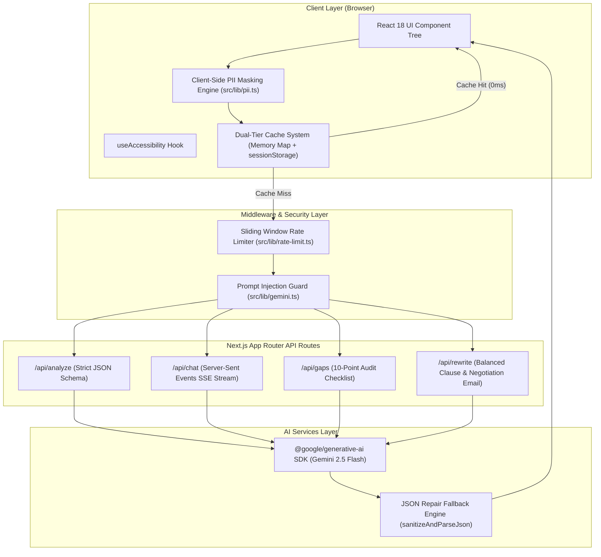

# Architecture Documentation — ContractLens AI

## 1. System Overview & Architecture Diagram

ContractLens AI is structured as a privacy-preserving, high-performance web application powered by Next.js 14 (App Router), TypeScript, Tailwind CSS, and Google Gemini 2.5 Flash.

## 2. Privacy & PII Pipeline
To guarantee that Personally Identifiable Information (PII) never reaches external cloud servers or AI models:
1. **Regex Pattern Engine**: Prior to sending data to `/api/*` endpoints, `src/lib/pii.ts` scans text in the browser.
2. **Replacement Strategy**:
   - Emails → `[EMAIL]`
   - Phone Numbers → `[PHONE]`
   - Monetary Amounts → `[AMOUNT]`
   - Named Parties / People → `[PARTY_A]`, `[PARTY_B]`
   - Physical Addresses → `[ADDRESS]`
3. **Visual Privacy Shield**: Real-time counter metrics confirm to the user the exact number of anonymized items.

## 3. Dual-Tier Caching System
- **Tier 1 (In-Memory `Map`)**: Retains parsed result objects in JS heap memory for instantaneous retrieval within the active session.
- **Tier 2 (`sessionStorage`)**: Persists hashed contract entries across tab refreshes during the browser session.
- **SHA-256 Hashing**: Inputs are hashed using `crypto.subtle` (or pure JS FNV fallback) to generate collision-resistant keys.
- **Cache Hits**: Identical contract inputs load in **0ms** without triggering API calls or incurring LLM token costs.

## 4. Security & Guard Rails
- **Prompt Injection Defense**: All user contract inputs are enclosed inside `<CONTRACT_TEXT>` tags. System instructions command Gemini to treat everything inside the tag strictly as data and never as instructions.
- **Rate Limiting**: Sliding-window rate limiter limits requests to 10 per minute per IP address on all `/api` routes, returning HTTP 429 when exceeded.
- **JSON Sanitizer & Repair Engine**: `sanitizeAndParseJson` handles LLM formatting anomalies (strips markdown code blocks, removes trailing commas, repairs unescaped quotes).

## 5. Accessibility & Performance
- **Dynamic Code-Splitting**: Tabs 2, 3, and 4 are dynamically loaded (`next/dynamic`, `ssr: false`) with loading skeletons, keeping the initial JS bundle size under 150kB.
- **WCAG 2.1 AA Compliance**: High-contrast dark color palette (min contrast ratio 4.5:1), font scale scaling (`normal`, `large`, `xlarge`), keyboard navigation (`1-4`, `?`, `Esc`), and `aria-live="polite"` announcements.
