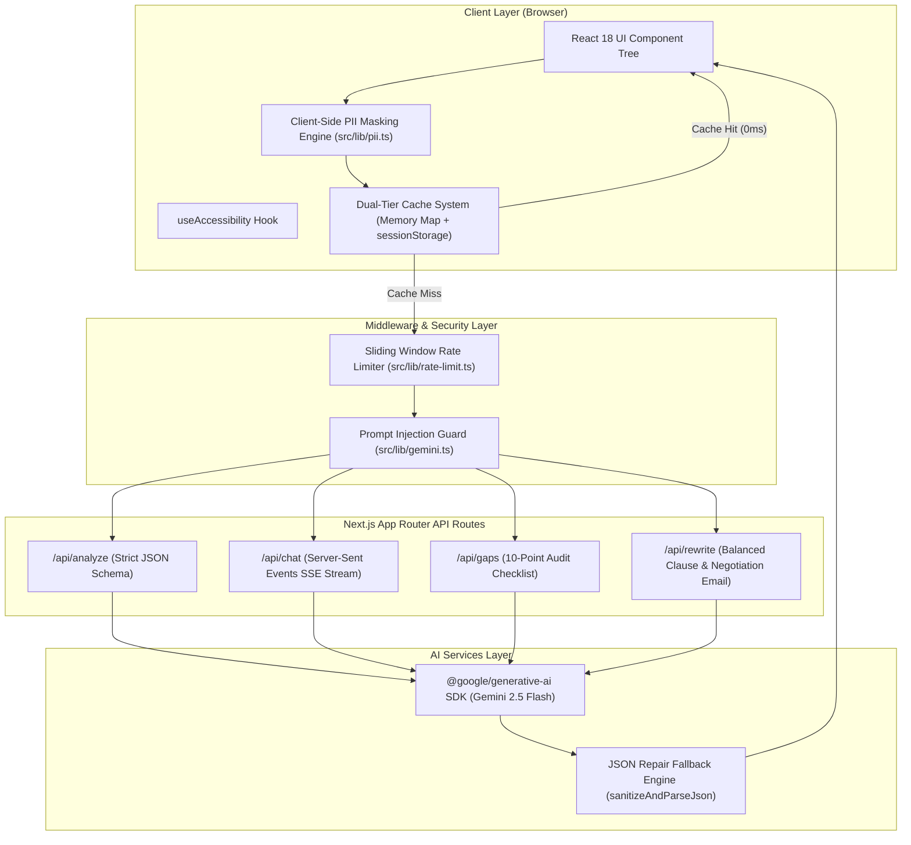

# ContractLens AI — AI Legal Contract Translator & Risk Analyzer

[](https.github.com/YourUsername/ContractLens-AI/actions)
[](https://nextjs.org/)
[](https://www.typescriptlang.org/)
[](https://tailwindcss.com/)
[](https://ai.google.dev/)
[](https://www.w3.org/WAI/standards-guidelines/wcag/)

> **ContractLens AI** translates dense, predatory legal agreements (freelance MSAs, rental leases, job offers, SaaS terms) into plain 8th-grade English, flags high-risk clauses, audits missing contract protections, and generates fair counter-proposals with polite negotiation email drafts.

---

## 🏛️ System Architecture



---

## ✨ Key Features

- **🛡️ Client-Side PII Privacy Shield**: Sanitizes names, emails, phone numbers, monetary amounts, and physical addresses in browser memory before dispatches. Zero PII leaves your browser unmasked.
- **📊 Risk Heatmap & Readability Calculator**: Color-coded risk cards (Critical, High, Medium, Safe) with Flesch-Kincaid Reading Ease & Grade Level metrics.
- **💬 Interactive SSE Contract Q&A**: Real-time streaming chat powered by Gemini 2.5 Flash. Answers strictly cite clauses; unmentioned terms explicitly return *"This contract does not mention that."*
- **📋 10-Point Missing Protection Audit**: Audits contracts against essential safeguards (mutual indemnity, liability caps, payment terms, termination for convenience, force majeure).
- **✍️ Safer Clause Rewriter & Negotiation Assistant**: Transforms one-sided clauses into fair terms and generates polite, professional email drafts with one-click clipboard support.
- **⚡ Dual-Tier Cache (0ms Hits)**: In-memory `Map` + `sessionStorage` indexed by SHA-256 string digest for instant re-renders.
- **♿ WCAG 2.1 AA Accessibility**: Dark high-contrast UI, keyboard shortcuts (`1-4`, `?`, `Esc`), font size scaling (`A`, `A+`, `A++`), and screen-reader `aria-live` announcements.

---

## 📁 Repository Structure

```
friendly-noether/
├── .github/workflows/ci.yml     # GitHub Actions CI workflow
├── src/
│   ├── app/
│   │   ├── api/                 # 4 API routes (analyze, chat, gaps, rewrite)
│   │   ├── globals.css          # Tailwind CSS & high-contrast rules
│   │   ├── layout.tsx           # App Root Layout
│   │   └── page.tsx             # Main App Router page with dynamic code-splitting
│   ├── components/              # UI components for all 4 tabs
│   ├── hooks/                   # useContractAnalysis & useAccessibility hooks
│   └── lib/                     # PII engine, Gemini SDK, Cache, Rate-limiter, Readability
├── tests/                       # 57+ Vitest unit test suite
├── ARCHITECTURE.md              # Detailed technical architecture document
├── DEMO_GUIDE.md                # Demonstration walkthrough guide
├── PRD.md                       # Product Requirements Document
├── README.md                    # Main Project Documentation
└── package.json
```

---

## 🚀 Quick Start

### 1. Clone & Install
```bash
git clone https://github.com/YourUsername/ContractLens-AI.git
cd ContractLens-AI
npm install
```

### 2. Environment Setup
Create a `.env.local` file:
```bash
GEMINI_API_KEY=your_google_gemini_api_key
```

### 3. Run Development Server
```bash
npm run dev
```
Navigate to `http://localhost:3000`.

---

## 🧪 Unit Testing

Run the 57+ Vitest unit test suite covering PII masking, Zod schemas, cache keying, rate limiting, JSON repair, and readability scoring:
```bash
npm test
```

---

## ☁️ Vercel Deployment

Deploy seamlessly to Vercel:
```bash
npm run build
```
1. Push to your GitHub repository.
2. Import the project into Vercel.
3. Add `GEMINI_API_KEY` under Environment Variables.
4. Deploy!

---

## 📜 Legal Disclaimer
*ContractLens AI is an educational tool and does not constitute formal legal advice or create an attorney-client relationship. Consult a licensed attorney for binding legal decisions.*
